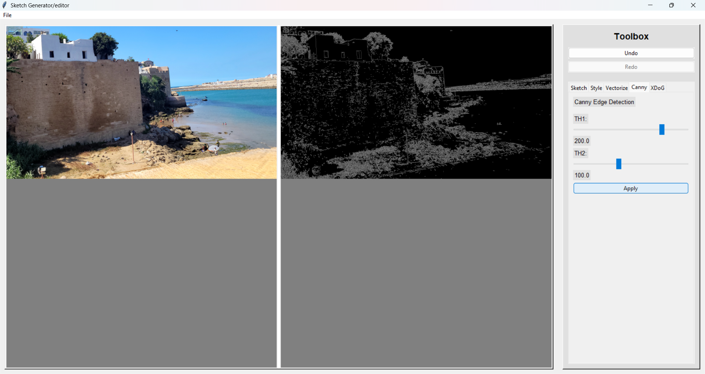
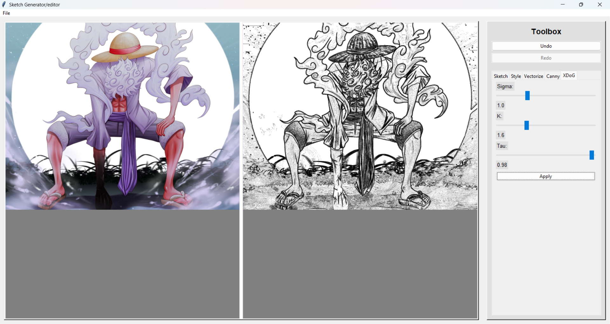
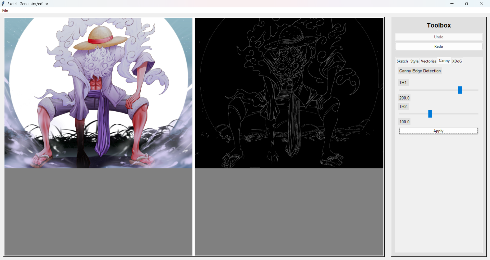
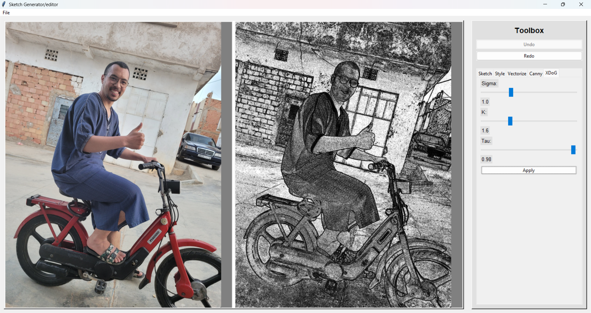
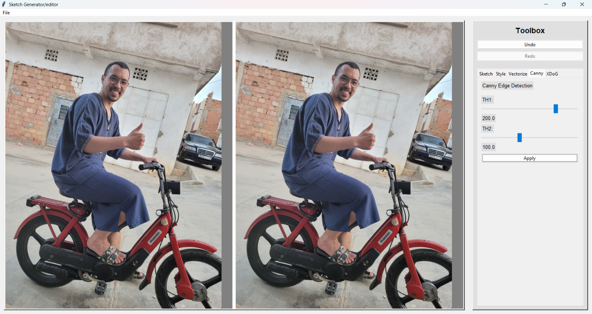
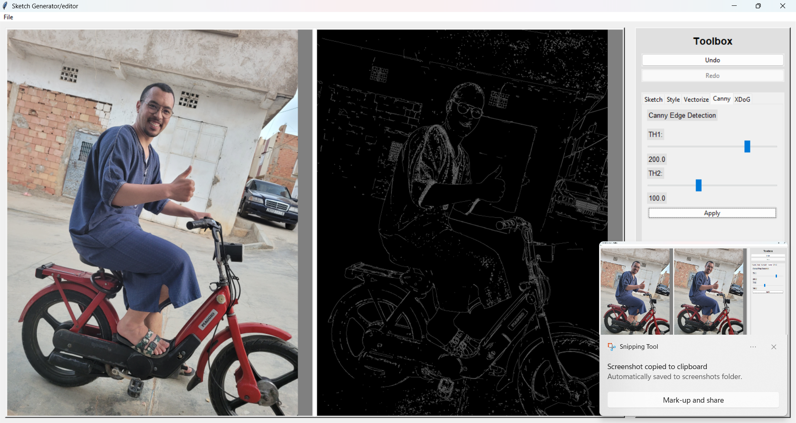

# Project: Image to Sketch Converter (CLI + GUI)

## Description
A dual-mode application that converts images to pencil sketches. Includes both command-line interface (CLI) and graphical user interface (GUI) implementations.

---

## Important Steps
1. Install Python 3.8+ and required packages
2. CLI: Use script with input/output parameters
3. GUI: Launch graphical interface for interactive conversion
4. Supports JPG, PNG, and BMP formats

---

## GUI Application Usage
1. Select input image via file browser
2. Adjust edge detection threshold (0-255)
3. Choose output path and filename
4. Click "Convert" to generate sketch
5. Supports real-time preview of threshold adjustments

---

## Command Line Usage
```bash
python sketch_generator.py --input input.jpg --output output.png --threshold 100
```
Parameters:
- --input: Input image path (required)
- --output: Output path (required)
- --threshold: Edge detection threshold (0-255, default: 127)
- --invert: Invert output colors (optional flag)

---

## Screenshots







---

## Files
- sketch_generator.py (CLI implementation)
- sketch_tkinter.py (GUI implementation)
- README.md (documentation)
=======
# one-line-drawing
